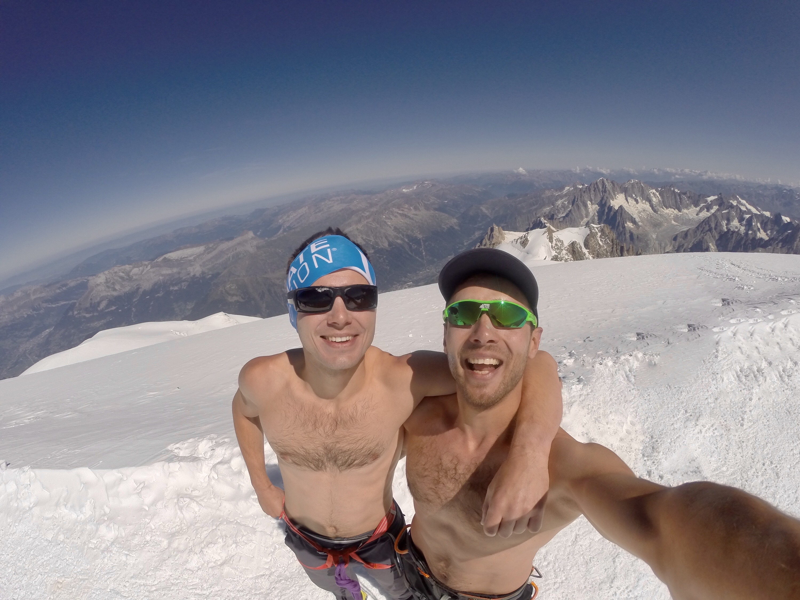

Czym są te słowa: "Fast and Light"?

Dla mnie to jest pewna filozofia w sposobie poruszania, a nawet w normalnym trybie życia.

Chodzi o staranie się być lekkim i szybkim. Nie ciągnąć ze sobą cały wór, precyzować celi w krótkim czasie, ewentualnie dzielić na etapy. 

Dotyczy to zarówno wspinaczki, biegania, zwiedzania, jak i projektowania w samym szerokim znaczeniu. Przytoczę przykład z programowania: założenie od początku wszystkich możliwych funkcjonalności w aplikacji i podpięcie bibliotek „molochów” od wszystkiego, raczej nie wpływa pozytywnie na czas dewelopmentu, a nawet może być przyczyna porażki i w ogóle niedowożenia. Tak i wciągnięcia na górę sprzętu do wyciągnięcia ze szczeliny jest nie potrzebne na klasycznej drodze na Monblanca, dla tego, że niebezpiecznych szczelin tam po prostu niema.
Nie mówię że ocenić drogę jest łatwo. Zależy od warunków, doświadczenia i naszej kondycji, i wiedzy o tym (często w tą, lub inna stronę błędna)
idealny zestaw sprzętowy dla mnie to... same spodenki :)

*Zdjęcie ze szczytu Białej Góry z sierpnia 2019, weszliśmy z kolegą w 9 godzin z dołu.*

