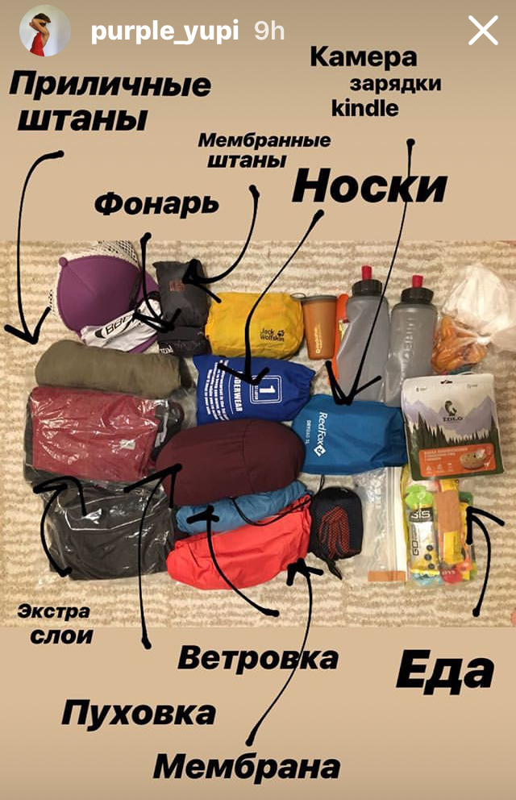

Cześć! 

Jeśli już odciełeś połowę szczoteczki do zębów i pierwsza rzecz w zakupie sprzętu to sprawdzenie ego wagi, to ty dobrze trafileś. Fastpaking, light bikepacking i takie tam słówka będę używać tutaj często i nie zawsze k miejscu. A jeśli na poważnie, będziemy wymysliać i opowiadać o wycieczkach szybkich i ambitnych, rekordach, sprzęcie i patentach przejscia.

Tematy które planuje opisać nie długo: przejscie Glównej Grani Tatr, Trawers Teneryfe, wejscie zimą na Aragac(Armenia).

Zdjęcie calego sprzętu Juli, która przebieglą cała wyspe Teneryfe i zaliczyla Tejde (3 718 m) w pare dni.

