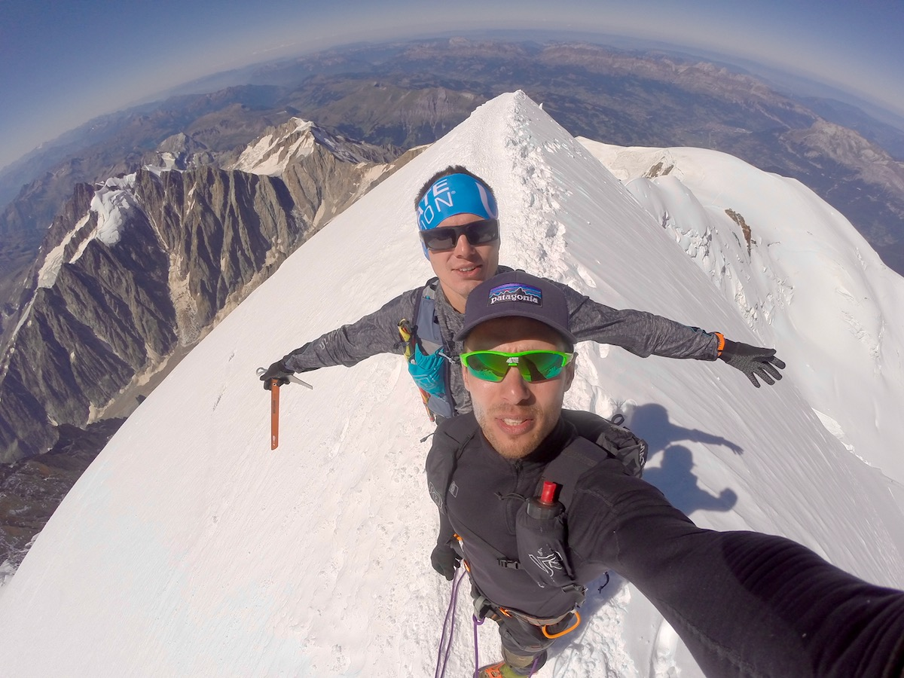

## Historia wejść na Mont Blanc

Chyba najbardziej znanym wejściem jest rekord [**Kiliana**](#KilianJornet) od 11 lipca 2013,  wtedy wejście na szczyt i zejście zajęło jemu **4h 57m**. Wcześniej rekord przynależał Szwajcarowi **Pierre-André Gobet**, który się trzymał z 1990 roku. Katalończyk poprawił ten czas o 14 minut. Trasa prowadzi przez lodowiec Bossons (dalej Grands Mulets – Vallot), więc nie jest super popularną. Na około 8 km jest 3800 metrów do góry. I tutaj na chwile się zatrzymamy...

## Są różne drogi!

### A do tego jeszcze niektórzy biegną tylko do góry, a chodzą spokojnie lub inną drogą

Kilian zrobił swój rekord startując z Chamonix. Jest jeszcze droga ze startem w Les Houches i Włosi, oczywiście, mają swoją wersje ze startem w Courmayer. I też są różne warianty (Drogą [Innominata](#Innominata) – rekord [**Kilian Jornet**](#KilianJornet), klasyczną włoską drogą poprzez Rifugio Gonnella–Col des Aiguilles Grises – rekord [**Marco De Gasperi**](#MarcodeGasperi)).

## Polskie osiągnięcia

Przez to, że jest taki balagan, sprobuje spisać tutaj znane mi wyczyny. Polskie szybkie wejście (o których słyszałem) byli do tej pory na drodze klasycznej ze startem w Les Houches (14km w jedną stronę i 3800 metrów podejść)

| Kto | Kiedy | Czas góra-dół | Czas góra |
| ---- | ---- | ---- | ---- |
| Rekord: [Mathéo Jacquemoud](#MatheoJacquemoud) | 20.08.2011 | nie wiadomo | 3:29 |
| [Marcin Pawłowski](MarcinPawlowski) | 06.08.2015 | schodził spokojnie | 4:04 |
| [Jacek Żebracki](#JacekZebracki) | 15.07.2015 | 6:13 | 4:17 |
| [Anna Figura](#AnnaFigura) | 28.08.2015 | schodził spokojnie | 5:17 |
| [Łukasz Żdanowski](#LZKG) | 18.09.2015 | 7:55 | 5:25 |
| [Kamil Grudzień](#LZKG) | 18.09.2015 | schodził spokojnie | 5:25 |
| [Marcin Rzeszótko](#AnnaFigura) | 28.08.2015 | schodził spokojnie | 5:53 |
| [Anna Tybor](#AnnaFigura)  | 28.08.2015 | schodził spokojnie | 6:15 |

## Doświadczenie osobiste

W porównaniu do wyżej wymienionych, moje skromne wejscie spacerem z kolegą zajeło nam 9h do góry i 17h góra-dól (17km w jedną strone i 3460m ➚ ). My wybrali jeszcze inny wariant drogi klasycznej na Mont Blanca, podobną jak z Les Houches, tylko z statem na parkingu [Bionnassay](https://goo.gl/maps/Fsyirds1JL86Wy1t6), więc zaczeli od okołó 1400mnpm. Tylko dla tego, że mieszkaliśmy od tej strony wzgórza :). Nie mieliśmy parcia na rekord a ni na żyłowanie się, do tego nie mieliśmy aklimatyzacji i czuli to po 4 tys. m. nad poziomem morza. Kto wie moją formę – wejść w jeden dzień nie jest żaden problemem, a z drugiej strony bardzo dobrze teraz rozumiem, że rekordy kosmiczne.

Nasz GPX Ilya Marchuk & Sergei Golubev  https://www.strava.com/activities/2652190347

### Inne ciekawe wejscia

[Alexandr Piegza](#AlexandrPiegza) jako 12-latek w dwanaście godzin wyszedł i zjechał na nartach z Mont Blanc

#### Notatki:

* **Kilian Jornet**
  * Les Houches <=> Mont Blanc https://www.strava.com/activities/2581257624/overview
  * Chamonix <=> Mont Blanc  http://www.movescount.com/moves/move15747562

* **Marco de Gasperi** klasyczną włoską drogą:
  * opis: http://www.boymountaindreams.com/files/Record_Bianco_ITA.pdf
  * film na youtube: https://www.youtube.com/watch?v=xZ_wZNxEp5k

* **Anna Figura** & Ko (Anna Tybor i Marcin Rzeszótko)
  * https://outdoormagazyn.pl/2015/09/wielka-trojka-na-wielkiej-czworce-przyjaciele-wbiegli-na-mt-blanc/

* **Mathéo Jacquemoud** record na trasie Les Houches => Mont Blanc
  * http://www.charleshedrich.com/index.php?option=com_content&task=view&id=1163&lang=en

* **Marcin Pawłowski**  Les Houches => Mont Blanc
  * https://wspinanie.pl/2015/08/marcin-pawlowski-rekordowo-w-gore-na-mont-blanc/

* **Jacek  Żebracki** Les Houches <=> Mont Blanc
  * https://wspinanie.pl/2015/07/jacek-zebracki-mont-blanc/

* **Łukasz Żdanowski** i **Kamil Grudzień** Les Houches <=> Mont Blanc
  * https://www.tygodniksiedlecki.com/g31427-wycieczka.na.mount.blanc..biegiem.-0-1.htm#

*  **Innominata** 
  * opis drogi https://www.camptocamp.org/routes/54513/en/mont-blanc-innominata-ridge

* **Alexandr Piegza**
  * https://podroze.onet.pl/ciekawe/rekord-alexandra-piegzy-12-latek-w-dwanascie-godzin-wyszedl-i-zjechal-na-nartach-z/70cjzk5