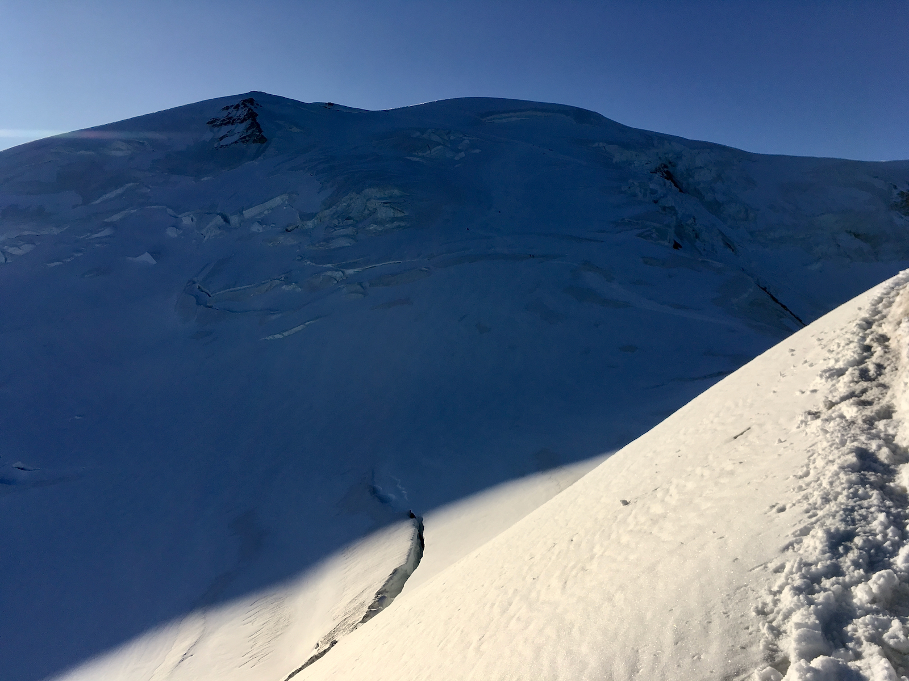
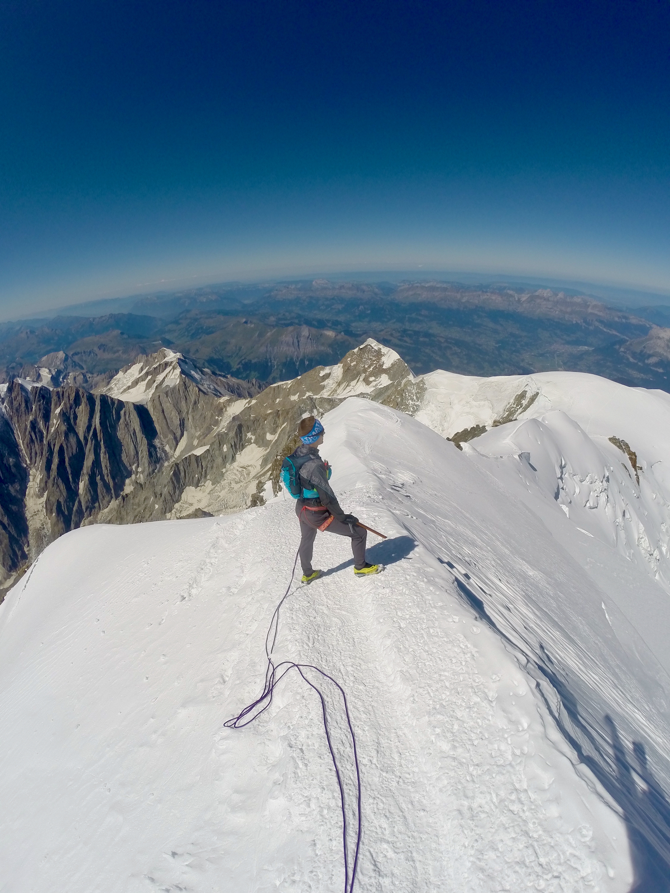
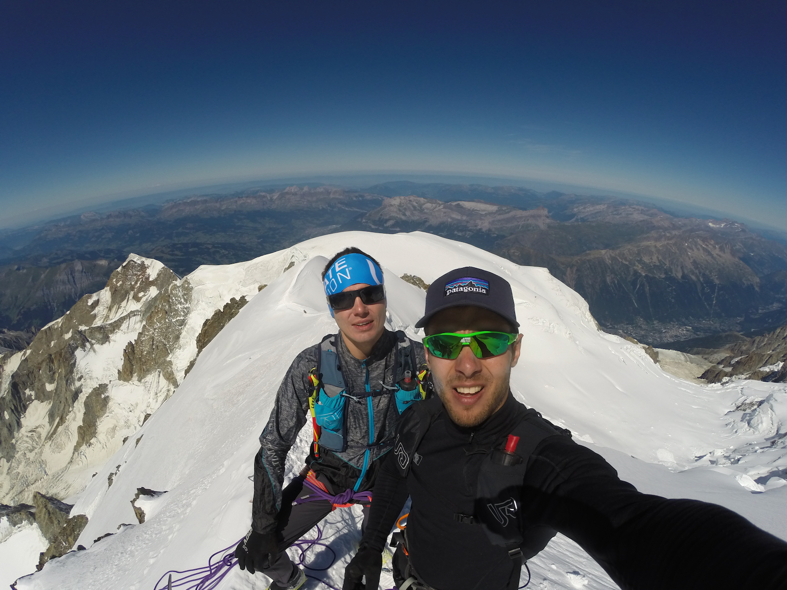

Ostrzeżenie:
Nie jest to artykuł doradczy, sugerować się należy tylko własnym doświadczeniem i kondycją. Sprzęt i ubrania należy dostosować do swoich umiejętności, sposobu poruszania i pogody.

## Kwestii prawne

Ostatnio wiele osób pytało mi o pozwolenia i o rejestrację wyjścia drogą klasyczną na Mont Blanca, więc opowiadam stan na koniec sierpnia 2019. Podejrzewam i liczę że po epidemii koronawirusa wróci do tego stanu, ponieważ w tym momencie (kwiecień 2020 r.) wszystkie aktywności górskie są zakazane.

Dokumenty Francuskiej żandarmerii  
http://chamoniarde.com/en/mountain-topics/regulation

Nowe reguły wejścia na Mont Blanca weszli w 2019 roku. Najważniejszą zmianą jest zakaz biwakowania na drodze klasycznej. Na lodowce *Tête Rousse* powstał kemping z rozstawionymi namiotami.
Więc jeśli ktoś zamierza wchodzić na górę z noclegiem musi zarezerwować pobyt w *Refuge du Goûter* lub *Refuge de Tête Rousse* lub na kempingu w pobliżu ostatnie wymienionego w stacjonarnych namiotach. Ceny można sprawdzić tutaj: https://montblanc.ffcam.fr/GB_tarifs-2.html

Na początku lodowca *Tête Rousse* siedzi od rana pan i sprawdza coś tam. Byliśmy tam dwa razy, oba razy widzieliśmy jego przy powrocie, do góry szliśmy przed świtem i nikogo tam nie było. Na drodze  powrotnej nic nas nie pytał, ograniczając “Bonjour”.

## Założenia

Ja byłem pod “Białą Górą” z okazji UTMB, który odbył się 31.08 – 1.09.2019. Mi towarzyszył na tym wyjeździe kolega z Białorusi z którym i zamierzaliśmy zrobić wejście w ciągu jednego dnia. Żeby najmniej narażać swój pierwszy 100milowy bieg wejście postanowiliśmy zrobić jak najwcześniej, to znaczy od razu po przyjeździe. 22 sierpnia zrobiliśmy rekonesans bez spiny do Refuge du Goûter (3,835 m npm). Zmierzyli czas i swoje poczucie wysokości. Wszystko super grało, tylko że spokojne wejście trochę trwało. Do góry szliśmy aż 4.5 godziny, pewnie dla tego że zrobiliśmy 2500 metrów w pionie [strava link](https://www.strava.com/activities/2641602787). Wygląda że nasze założenia realne – w jeden dzień spokojnie się wyrobimy. Pod warunkiem że góra nas puści.

## Realizacja 

Dwa dni odpoczynku (lekki trucht w moim przypadku) i 25 sierpnia o 3 nad ranem wyruszyliśmy z parkingu [Bionnassay](https://goo.gl/maps/9D3gi4iWZVexTGeN6). Naszą drogę opisywałem na tym wpisie + dodałem tam mapę [link](https://fastlight.pl/rekord-mont-blanc/MontBlanc/). Pogoda zapowiadała się idealna, bezchmurnie i prawie bez wiatru. Jedyne zagrożenie którzy mogą stać nam na drodze to oparzenia słoneczne i wysokość. Postanowili w krótkich spodenkach nie iść =)

Podejście do 3 tys m npm po ciemku, po drodze spotkamy jeszcze dwie takie pary, którzy ewidentnie mieli taki sam plan jak i my. W okolicach *Cabane des Rognes* delikatnie zeszli z głównej ścieżki i pobłądzili tracąc około 30 minut. Jak macie GPS, mi się wydaje, warto wgrać, po ciemku można łatwo pomylić ścieżkę, których w dolnej części jest sporo wytapane. Mieliśmy traka, ale przecież byłem pewien, że dwa dni temu zwiedzona trasa jest już sprawdzona i etc, lekceważące … 

## Grand Couloir

Najbardziej straszą żlebem, który trzeba przetrawersować, długości mniej niż 100m. W wielkich górach na coś takiego nie zwracają nawet uwagi, ale tutaj jak cały czas chodzą to w jedną, to w drugą stronę ludzi co roku zdarzają się wypadki. Przez to kuluar ma złą reputację. Kask najczęściej biorą tylko dla tego miejsca. Reszta podejścia jest gęsto zabezpieczona poręczówkami. Trzeba użyć rąk, ale trudności wspinaczkowe w okolicach zera. Fizycznie najbardziej stromy odcinek. 

<video width="100%" src="./GOPR1761_1080.mp4" poster="./GOPR1761_1080_cover.jpg" muted preload controls title="video Grand Couloir trudności"></video>

## Jednak jest wysokość

Tym bardziej że bez żadnej aklimatyzacji. Po 3800 byliśmy już w raczkach i podchodząc w cieniu Dôme du Goûter zaczęli odczuwać odcięcie energetyczne. Już nie było szans na jakiś dobry czas, zostało nam spokojnie podchodzić jak puszcza zdrowie. W cieniu, wczesnym ranem było zimno, zacząłem nawet czuć że zamarzają stopy. 

Byłem w lekkich butach i kolega również. Niby drobiazg, ale tutaj trzeba dawać sobie sprawę z tego, że jeśli coś się wydarzy i będziesz musiał siedzieć przez parę godzin – możesz sobie poważnie odmrozić stopy. Dla tego nikt z przewodników takiego ekwipunku nie zaakceptuje. Przez ten zimny poranek na wysokości nie mogliśmy całkiem wyluzować i musieli maszerować pod górę, rozgrzewając się. Raczki dawali rady, ale też czasem wolałbym mieć normalne raki. 

Na grani przed kopułą szczytową wiążemy linę na wszelki wypadek, ekspozycja ładna, jak polecisz szans na zahamowanie czekanem nie dużo. Mijamy ludzi, większość już schodzi, ale sporo wyprzedzamy i na podejściu, większość na miękkich nogach i ja bał się najwięcej takich osób. Za *Dôme du Goûter* z całej mocy grzeje słońce, zaczyna być ciepło, wiatru prawie nie ma, jak w bajce. 

Żeby nie było zbyt kolorowo, zacząłem odczuwać, że nie mogę sfokusować wzroku, to są pierwsze objawy ślepoty śnieżnej. Moi okulary z *Orobie Ultra Trail* byli za słabi na taki poziom promieniowania. Na szczęście jakoś przetrwałem wymieniać z kolegą okularami. Zamykając po kolei to jedno to drugie oko. (Moje górskie okulary zgryz mój syn – ząbkowanie, wiecie :-)) Też jest dobra notatka na przyszłość.

Dotarcie do szczytu w takim stylu zajęło nam ponad 9 godzin, zejście ponad 8 godzin, w tym ani razu nie biegliśmy i zatrzymywaliśmy tylko po technicznym potrzebam. Zejście spacerem było dość długie i uciążliwe mentalnie, ale postanowiliśmy nie zbiegać w dół oszczędzając czwórki i tego się trzymali. 

Wyczerpani energetycznie, ale bez jakichkolwiek problemów mięśniowych lub zdrowotnych wieczorem wrócili na kolacje. Po tym już plaża i odpoczynek do startu kultowego biegu dookoła Białej Góry. Zabiegając do przodu powiem, że przebiegłem jego bez większych problemów, ale to już inna historia. 

Czy to można nazwać Fast And Light ? :) 

P.S. Jeśli chcesz ocenić formę fizyczną do takiej wycieczki podam parę danych. 
Biegam stabilnie 10 km w +/- 35 minut na ulicę. Uczestniczyłem w [MonteRosa SkyRace (wbiegaliśmy na 4500 m npm)](https://napieraj.pl/monte-rosa-maraton-szalony-wyscig-jorneta-i-forsberg/) i zrobiliśmy z Łukaszem Zdanowskim to trasę w 6 godzin 18 minut. Wspinam się sportowo i mam parę prowadzonych dróg 8a. Ze średniej szkoły biegałem w zawodach z technik linowych i ratownictwa (taka niszowa lokalna zabawa na Białorusi =) 